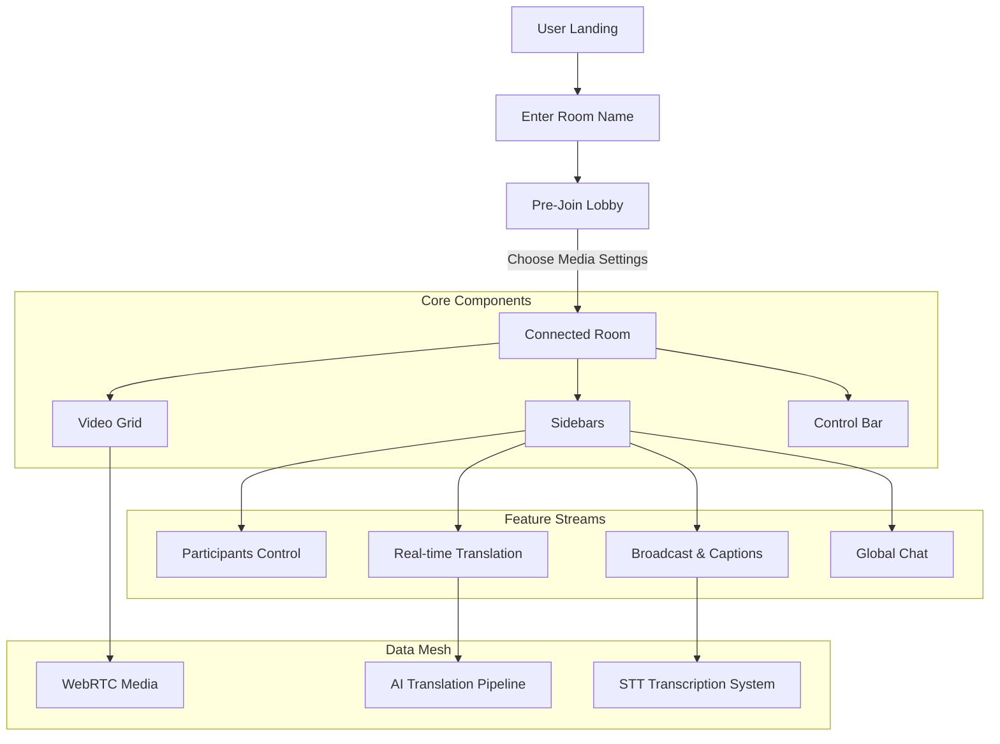

# Success Class powered by Orbit SI

**Success Class** is a premium, high-performance video conferencing platform designed for seamless communication and real-time collaboration. Built with a focus on visual excellence and robust functionality, Success Class provides a state-of-the-art interface for moderating global classes and meetings, powered by Orbit SI.

---

## 🚀 Key Features

- **🌐 Intelligent Translation**: Real-time translation with support for multiple providers (Google and Ollama) and custom voice synthesis.
- **🎙️ Advanced Broadcast**: High-fidelity transcription and captioning capabilities with centralized control.
- **🛡️ Host Moderation**: Granular controls for participant media, including remote muting and session management.
- **📱 Responsive Design**: Seamless experience across mobile and desktop with a consistent, premium UI/UX.
- **💬 Seamless Collaboration**: Real-time chat with automated translation support.

---

## 🗺️ Application Flow

The following diagram illustrates the core session flow and component architecture of Eburon Meet:



---

## 🛠️ Development Setup

To get your local instance of Eburon Meet running, follow these steps:

### 1. Prerequisites

Ensure you have the latest version of `node` and `pnpm` installed.

### 2. Installation

Clone the repository and install dependencies:

```bash
pnpm install
```

### 3. Configuration

Create a `.env.local` file in the root directory and configure your credentials:

```env
# Eburon Infrastructure
EB_API_KEY=your_api_key
EB_API_SECRET=your_api_secret
EB_BASE_URL=https://api.eburon.ai

# AI Services
EB_AI_TOKEN=your_token
EB_VOICE_ID=aurora-narrator
```

### 4. Start Development

Launch the development server:

```bash
pnpm dev
```

Explore the application at `http://localhost:3000`.

---

## 💎 Design Consistency

Every element of Eburon Meet adheres to the **Eburon Design System**, ensuring a unified and premium brand identity across all user-facing interfaces.

---

© 2026 [Eburon AI](https://eburon.ai). All rights reserved.
